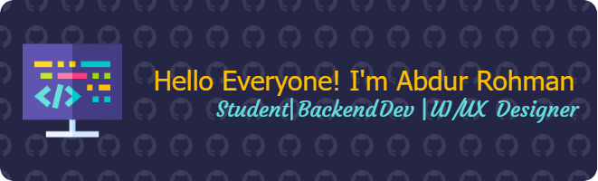

<!--
**rohmansyh/rohmansyh** is a ✨ _special_ ✨ repository because its `README.md` (this file) appears on your GitHub profile.

Here are some ideas to get you started:

- 🔭 I’m currently working on ...
- 🌱 I’m currently learning ...
- 👯 I’m looking to collaborate on ...
- 🤔 I’m looking for help with ...
- 💬 Ask me about ...
- 📫 How to reach me: ...
- 😄 Pronouns: ...
- ⚡ Fun fact: ...
-->

- 🔭 **I’m currently studying on University Brawijaya**
- 🌱 **I’m currently learning Laravel Framework**
- 😁😁😁

##### Tech Stack

          

##### Use of AI

 

##### Socials

  

#### 📊 GitHub Stats:

    
    
  
  

#### 🏆 GitHub Trophies

#### Play games with me

###

###

 

###

<picture>
  <source media="(prefers-color-scheme: dark)" srcset="https://raw.githubusercontent.com/rohmansyh/rohmansyh/output/pacman-contribution-graph-dark.svg">
  <source media="(prefers-color-scheme: light)" srcset="https://raw.githubusercontent.com/rohmansyh/rohmansyh/output/pacman-contribution-graph.svg">
  
</picture>

###

<!-- Proudly created with GPRM ( https://gprm.itsvg.in ) -->